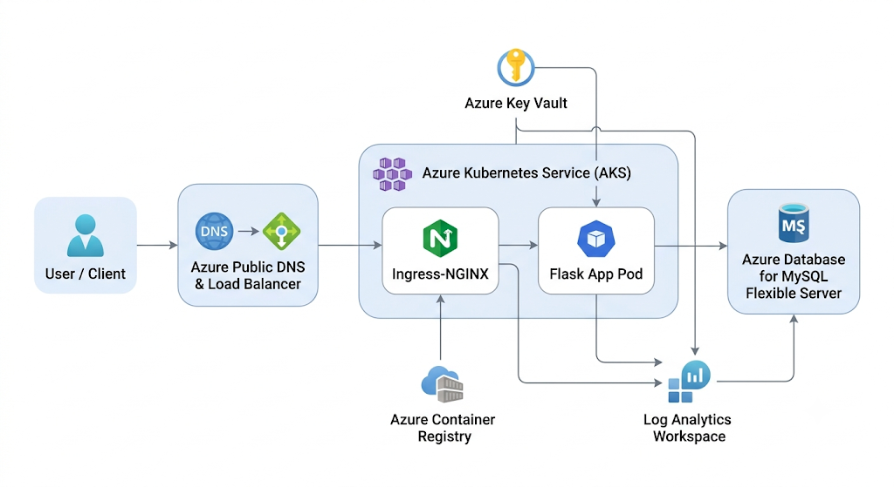
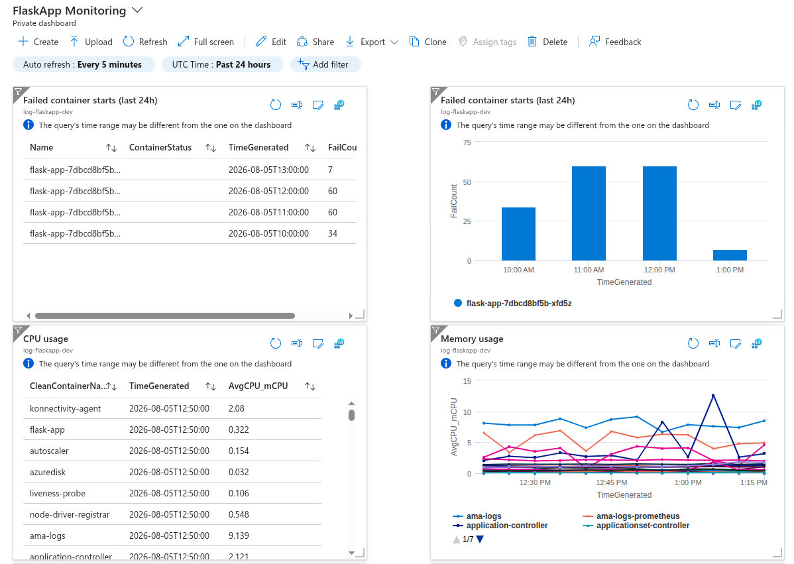
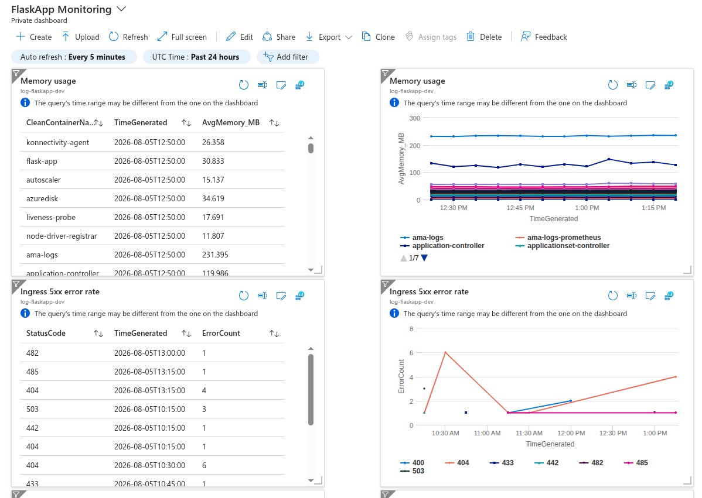
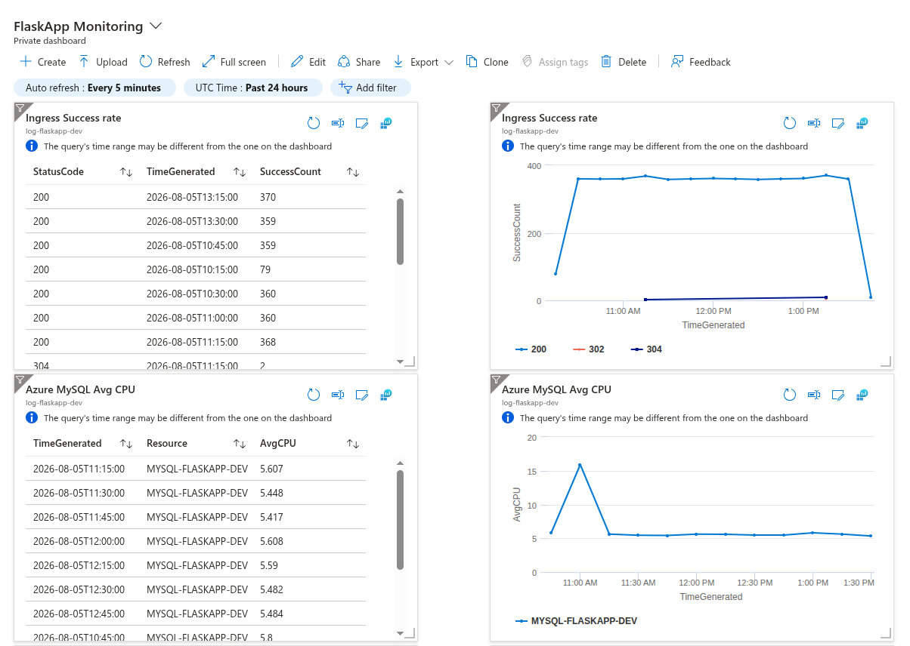
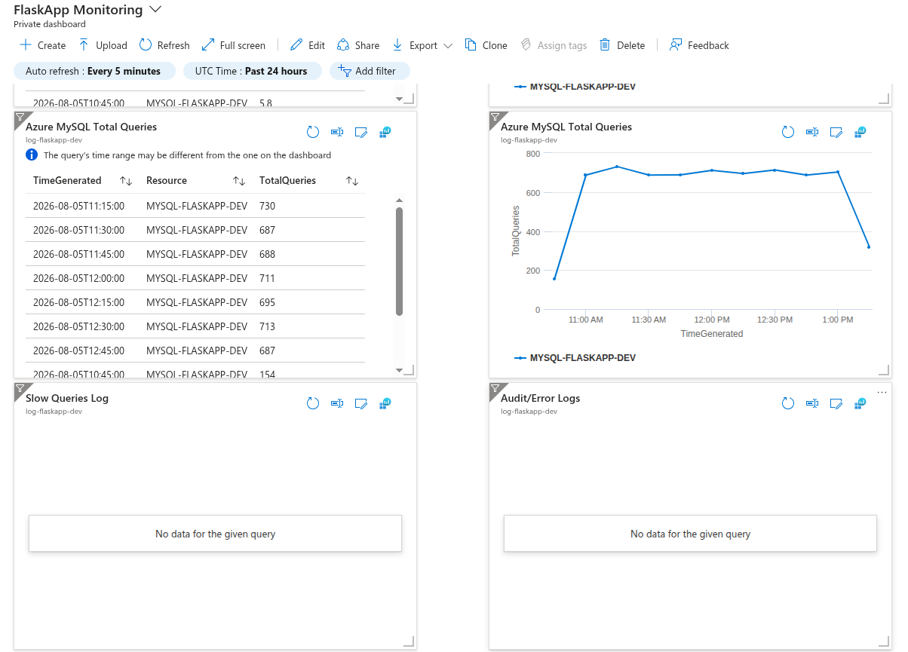
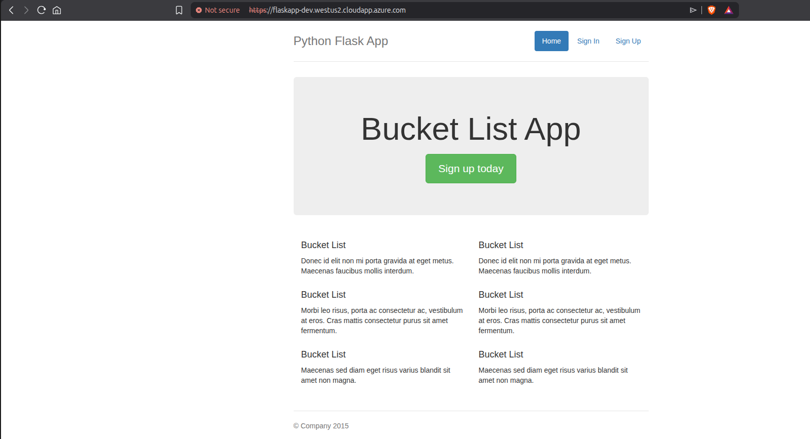
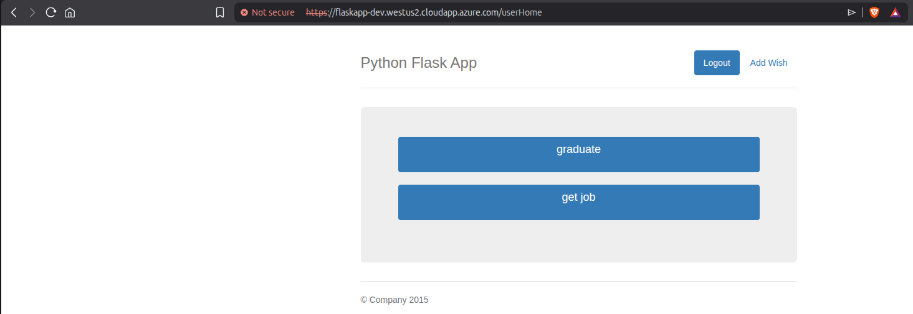
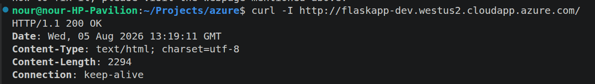
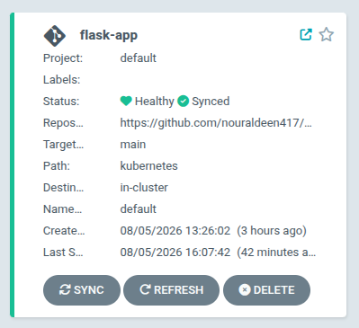

# Cloud-Native Flask on Azure Kubernetes Service

A production-style, cloud-native deployment of a Flask application on Azure Kubernetes Service (AKS), built end-to-end with Terraform, GitHub Actions (OIDC), Argo CD, and Azure-managed services. 


## Table of Contents

- [Overview](#overview)
- [Architecture](#architecture)
- [Prerequisites](#prerequisites)
- [Repository Structure](#repository-structure)
- [Identity & Security Model](#identity--security-model)
- [Deployment Guide](#deployment-guide)
- [CI/CD Pipelines](#cicd-pipelines)
- [GitOps (Argo CD)](#gitops-argo-cd)
- [Database](#database)
- [Observability](#observability)
- [Teardown](#teardown)
- [Architecture Decisions & Tradeoffs](#architecture-decisions--tradeoffs)
- [Screenshots](#screenshots)

---

## Overview

**What this project deploys:**
- A Flask web app (user signup/login, wishlist CRUD) — `src/`
- Backing store: Azure Database for MySQL Flexible Server
- Container platform: Azure Kubernetes Service (AKS)
- Image registry: Azure Container Registry (ACR)
- Secrets: Azure Key Vault, synced into the cluster via the Key Vault CSI driver
- Continuous Delivery: Argo CD (GitOps, auto-sync from this repo)
- Ingress: ingress-nginx, exposed via an Azure-provided public DNS name
- Observability: Azure Monitor / Log Analytics (Container Insights)
- IaC: Terraform, remote state in Azure Blob Storage with native locking
- CI/CD: GitHub Actions, authenticated to Azure via OIDC (no stored credentials)

**What it's meant to demonstrate:**
- Infra/App pipeline separation with least-privilege identities
- GitOps delivery instead of direct `kubectl apply`
- Managed PaaS over in-cluster stateful services
- Secrets sourced from a vault, not plain Kubernetes Secrets
- Supply-chain-aware CI (image vulnerability scanning, pinned actions)

![\[DIAGRAM: high-level architecture — Azure resources, AKS internals, traffic flow\]](<images/project diagram.png>)

---

## Architecture

**Azure resources (Terraform-managed):**

| Resource | Purpose |
|---|---|
| Resource Group | Container for all project resources (manually pre-provisioned) |
| Virtual Network + Subnet | Network boundary for AKS (Azure CNI) |
| AKS Cluster | Kubernetes control plane + nodes |
| Azure Container Registry | Stores built Flask images |
| Azure Database for MySQL Flexible Server | Application database (SSL-enforced) |
| Azure Key Vault | Stores the DB admin password |
| Log Analytics Workspace | Central destination for logs/metrics |

**Inside the cluster:**

| Component | Namespace | Purpose |
|---|---|---|
| Argo CD | `argocd` | GitOps sync engine |
| ingress-nginx | `ingress-nginx` | L7 routing, public entry point |
| Flask app | `default` | Application Deployment/Service |
| Key Vault CSI driver | (AKS addon) | Syncs Key Vault secret → K8s Secret |



---

## Prerequisites

> Full one-time setup commands (Service Principals, federated credentials, state backend, first apply, etc.) are documented separately in [`docs/PREREQUISITES.md`](docs/PREREQUISITES.md). This section is a summary of what's needed — see that file for exact commands.

**Local tooling:**
- Azure CLI (`az`), logged in (`az login`) with Owner rights on the target subscription (or at least on the Resource Group once created)
- Terraform >= 1.7.0
- `kubectl`
- GitHub CLI (`gh`), authenticated (`gh auth login`)
- `mysql` client (for one-time schema verification / manual DB access)

**Azure setup (one-time, manual — see [Identity & Security Model](#identity--security-model) for why):**
1. A Resource Group, pre-created and imported into Terraform state
2. Two Entra ID App Registrations (Service Principals), each with a federated (OIDC) credential trusting this repo:
   - App pipeline SP — `AcrPush` on the ACR
   - Infra pipeline SP — `Owner` scoped to the Resource Group only
3. GitHub repo secrets/variables populated (see table below)

**GitHub repo secrets:**

| Secret | Purpose |
|---|---|
| `AZURE_CLIENT_ID` | App pipeline SP client ID |
| `AZURE_INFRA_CLIENT_ID` | Infra pipeline SP client ID |
| `AZURE_TENANT_ID` | Tenant ID |
| `AZURE_SUBSCRIPTION_ID` | Subscription ID |
| `MYSQL_ADMIN_PASSWORD` | DB admin password (used via `TF_VAR_`) |
| `ADMIN_PAT` | Fine-grained PAT with repo Variables write access (used only to sync `ACR_LOGIN_SERVER`) |

**GitHub repo variables:**

| Variable | Purpose |
|---|---|
| `ACR_LOGIN_SERVER` | Auto-synced by the infra pipeline after every apply |


---

## Repository Structure

```
.
├── terraform/
│   ├── backend.tf              # remote state config (Azure Blob)
│   ├── providers.tf
│   ├── variables.tf
│   ├── terraform.tfvars        # non-sensitive config, committed
│   ├── secrets.auto.tfvars     # DB password, gitignored
│   ├── resource-group.tf
│   ├── network.tf              # VNet + Subnet
│   ├── log-analytics.tf
│   ├── acr.tf
│   ├── aks.tf
│   ├── key-vault.tf
│   ├── mysql.tf
│   ├── rbac.tf                 # role assignments (ACR push, KV reader)
│   ├── helm-argocd.tf
│   ├── helm-ingress-nginx.tf
│   └── outputs.tf
├── kubernetes/
│   ├── flask-deployment.yml
│   ├── flask-config.yml        # ConfigMap
│   ├── flask-service.yml
│   ├── flask-ingress.yml
│   ├── storage-class.yml       # Azure Files CSI
│   ├── db-schema-configmap.yml # PreSync hook, wave -1
│   ├── db-schema-job.yml       # PreSync hook, wave 0
│   └── secret-provider-class.yml   # applied manually — see note below
├── src/
│   └── flaskapp/                # application code
├── argocd-app.yaml               # Argo CD Application manifest (applied once, manually)
├── .github/workflows/
│   ├── infra-pipeline.yml
│   ├── infra-destroy.yml
│   └── ci.yml
├── docs/
│   ├── PREREQUISITES.md          # one-time manual setup, all commands
│   ├── OPERATIONS.md             # day-to-day command reference
│   └── MONITORING.md             # KQL queries, alert rule, dashboard setup
└── README.md
```

> **Note:** `secret-provider-class.yml` is intentionally **not** synced by Argo CD and is applied manually (`kubectl apply -f`). It contains the Key Vault CSI addon's identity/tenant/vault identifiers — not secrets by Azure's classification, but kept out of the public repo as a deliberate defense-in-depth choice. See [Architecture Decisions & Tradeoffs](#architecture-decisions--tradeoffs).

[DIAGRAM: repo structure ↔ pipeline ↔ Azure resource ownership map]

---

## Identity & Security Model

Two separate GitHub-OIDC-authenticated identities, matching a real enterprise infra/app split:

- **Infra pipeline SP** — `Owner`, scoped to a single, manually pre-provisioned Resource Group only (not subscription-wide). Can manage resources and role assignments within that RG. Has zero Entra ID directory permissions (App Registration creation is a separate, manual, admin-performed step — Azure RBAC and Entra directory roles are different permission systems).
- **App pipeline SP** — `AcrPush` only, scoped to the ACR. Cannot touch infrastructure.

No static credentials anywhere — both pipelines authenticate via OIDC federated credentials, trust scoped to `repo:<org>/<repo>:ref:refs/heads/main`.

Secrets flow: `terraform.tfvars` (committed, non-sensitive) + `secrets.auto.tfvars` (gitignored, DB password) → Terraform → Azure Key Vault → AKS Key Vault CSI driver → synced K8s Secret → Flask Deployment env var. No password ever touches the Kubernetes manifests directly.

---

## Deployment Guide

1. `az login`, create the Resource Group manually, import into Terraform state
2. Create both Service Principals + federated credentials (see [`docs/PREREQUISITES.md`](docs/PREREQUISITES.md))
3. Populate GitHub secrets/variables
4. Push to `terraform/**` on `main` → infra pipeline plans → manual approval → applies
5. Infra pipeline syncs `ACR_LOGIN_SERVER`, then triggers the app pipeline
6. App pipeline builds, Trivy-scans, pushes the image, auto-commits updated manifests
7. Connect to the cluster: `az aks get-credentials ...`
8. Apply the Argo CD `Application` manifest once (`kubectl apply -f argocd-app.yaml`)
9. Apply the `SecretProviderClass` manually (see structure note above)
10. Argo CD takes over — syncs Deployment, Service, ConfigMap, Ingress, schema-load hook

Full command reference: see [`docs/OPERATIONS.md`](docs/OPERATIONS.md).

---

## CI/CD Pipelines

**`infra-pipeline.yml`** — triggers on `terraform/**` changes. `plan` job always runs; `apply` job runs only if the plan shows real changes, gated behind a GitHub Environment manual-approval step. On success, syncs `ACR_LOGIN_SERVER` and (via `workflow_run`) triggers `ci.yml`.

**`ci.yml`** — triggers on `src/**` changes, `workflow_run` (after successful infra apply), or manual `workflow_dispatch`. Builds the image, scans it with Trivy (pinned to a commit SHA, gating on CRITICAL/HIGH), pushes to ACR only if the scan passes, then auto-commits the updated image tag into the K8s manifests for Argo CD to pick up.

**`infra-destroy.yml`** — manual-only (`workflow_dispatch`), requires typing `destroy` as confirmation plus the same environment approval gate as apply. Used for the region-migration/rebuild cycles during this project's development.

<div align="center">

[](https://github.com/nouraldeen417/cloud-native-flask/actions/workflows/infra-pipeline.yml)
[](https://github.com/nouraldeen417/cloud-native-flask/actions/workflows/ci.yml)
[](https://github.com/nouraldeen417/cloud-native-flask/actions/workflows/infra-destroy.yml)

</div>

---

## GitOps (Argo CD)

Argo CD watches the `kubernetes/` folder on `main` and auto-syncs (prune + self-heal enabled). Two resources are `PreSync` hooks (schema ConfigMap at wave `-1`, schema-load Job at wave `0`) so the database schema is idempotently applied before every application sync — safe to re-run, no manual DB step required after initial setup.

 

---

## Database

Azure Database for MySQL Flexible Server, SSL-enforced. Firewall currently allows Azure-internal traffic broadly (`AllowAzureServices`) rather than being scoped to AKS's specific outbound IP — a time-constrained tradeoff, noted below. Schema is idempotent SQL (`CREATE TABLE IF NOT EXISTS`, `INSERT IGNORE`, `DROP PROCEDURE IF EXISTS` before every `CREATE PROCEDURE`), loaded automatically via the Argo CD PreSync hook.

---

## Observability

Container Insights ships pod/container logs and metrics to the Log Analytics Workspace automatically. Saved KQL queries cover failed container starts, high CPU/memory usage, and ingress 5xx error rates. One alert rule and one pinned dashboard are configured off these queries.

Full step-by-step setup (queries, alert rule, dashboard): [`docs/MONITORING.md`](docs/MONITORING.md)

   

---

## Teardown

```bash
terraform destroy
```
(or trigger `infra-destroy.yml` manually). The Resource Group itself is **not** managed by Terraform (referenced as a data source) and is not destroyed by this — delete it separately with `az group delete` when fully done with the project.

---

## Architecture Decisions & Tradeoffs

Honest notes on deliberate simplifications made under the project's time constraints:

- **PaaS over StatefulSet** — managed MySQL instead of in-cluster database, avoiding Day 2 operational complexity.
- **Local-then-CI Terraform** — bootstrapping steps (RG creation, first import) were run locally under an admin identity; ongoing changes flow through the infra pipeline.
- **MySQL firewall scope** — allows Azure-internal traffic broadly rather than a tightly scoped rule or private endpoint, given the project's timeline.
- **SecretProviderClass applied manually** — kept out of the public GitOps-synced folder despite containing non-secret identifiers, as a deliberate defense-in-depth choice.
- **No automated schema-file management via Terraform** — schema loading lives in the Kubernetes/Argo CD layer instead, keeping infra and app-data concerns separate.
- **Key Vault named with a random suffix** — avoids soft-delete name collisions across destroy/rebuild cycles during development.
- **Trivy pinned to a commit SHA**, not a version tag — following the action maintainers' own post-incident hardening guidance.

---

## Screenshots

   

<!--  -->