# Project Gallery: Cloud-Native Flask

This document contains visual verification of the multi-cloud infrastructure, CI/CD pipelines, observability dashboards, and disaster recovery procedures.

---

## 1. Live Application
<table width="100%">
  <tr>
    <td align="center"></td>
    <td align="center"></td>
  </tr>
  <tr>
    <td align="center"><b>Application Home Page</b></td>
    <td align="center"><b>User Login & Wishlist</b></td>
  </tr>
</table>

---

## 2. GitOps Delivery (Argo CD)
<table width="100%">
  <tr>
    <td align="center">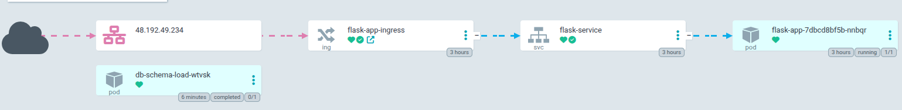</td>
    <td align="center">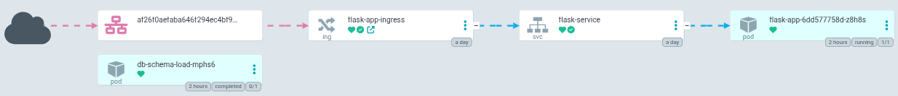</td>
  </tr>
  <tr>
    <td align="center"><b>Azure AKS Sync Status</b></td>
    <td align="center"><b>AWS EKS Sync Status</b></td>
  </tr>
</table>

---

## 3. Observability & Monitoring

### Azure Monitor & Log Analytics
*The dashboard below tracks cluster health, ingress traffic, and query performance.*

  
  
  
  

### AWS CloudWatch
*Terraform-provisioned dashboard monitoring EKS node resources and RDS metrics.*

  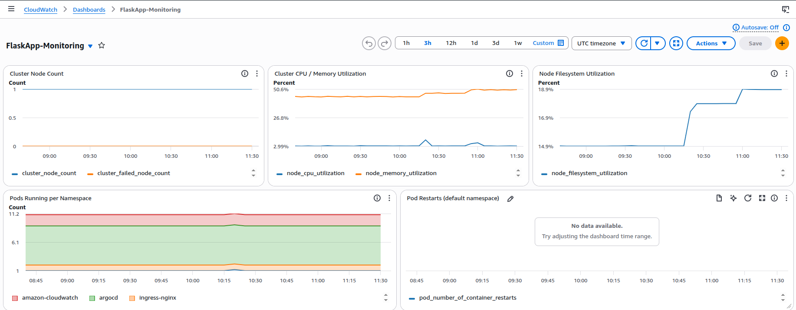
  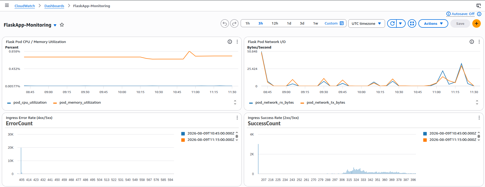
  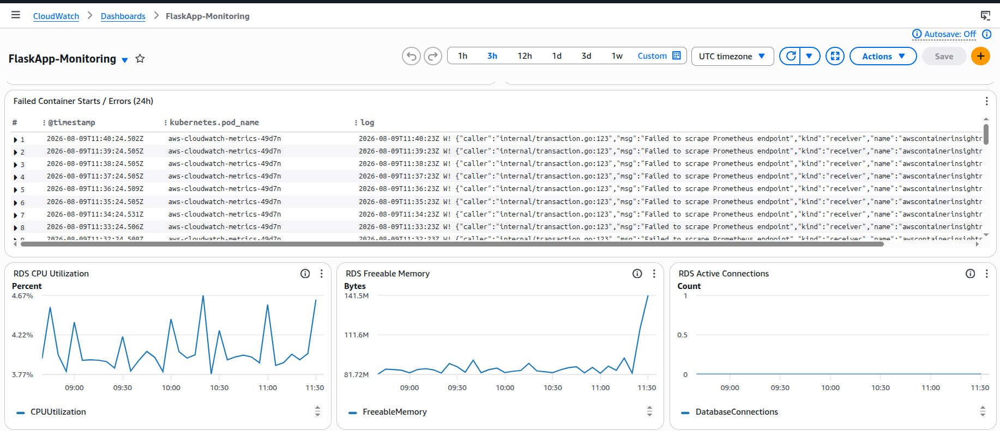

---
## 4. DNS & Network Verification
<table width="100%">
  <tr>
    <td align="center"></td>
    <td align="center">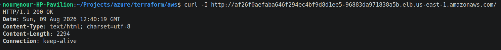</td>
  </tr>
  <tr>
    <td align="center"><b>Azure Ingress Resolution</b></td>
    <td align="center"><b>AWS NLB Endpoint Resolution</b></td>
  </tr>
</table> 

## 5. Cross-Cloud Disaster Recovery
*Visual walkthrough of the Azure MySQL to AWS S3 to AWS RDS restore process.*

**Step 1: Nightly Backup Job Execution**

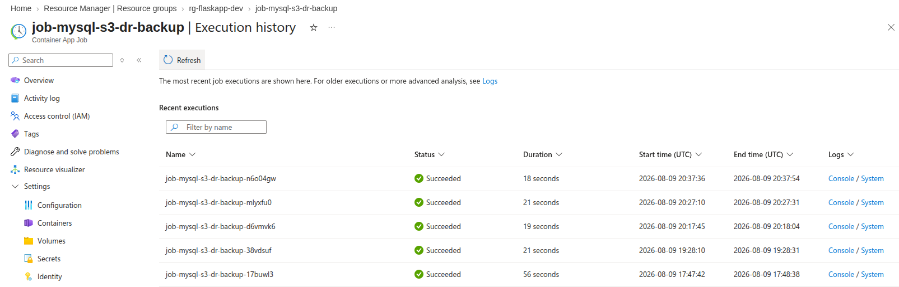

**Step 2: S3 Bucket Verification**

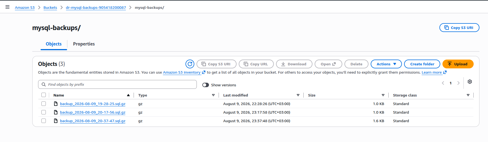

## 4. Disaster Recovery Validation (Cross-Cloud Data Consistency)

*This section demonstrates a successful Disaster Recovery event. After routing the Azure MySQL backup through S3 and restoring it into AWS RDS, the exact same user credentials and data state are immediately available on the independent AWS deployment.*

<table width="100%">
  <tr>
    <td align="center"><h3>Primary Environment (Azure)</h3></td>
    <td align="center"><h3>Recovery Environment (AWS)</h3></td>
  </tr>
  
  <!-- Row 1: Login Screens -->
  <tr>
    <td align="center">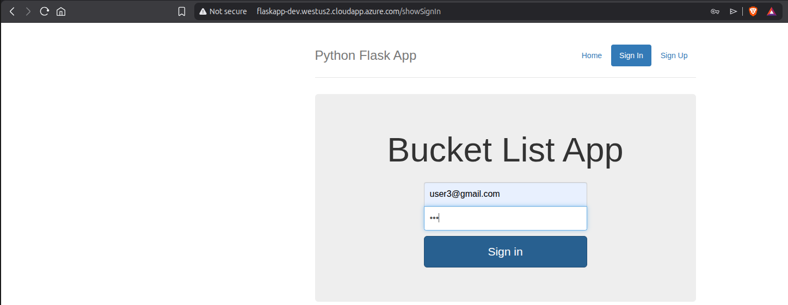</td>
    <td align="center">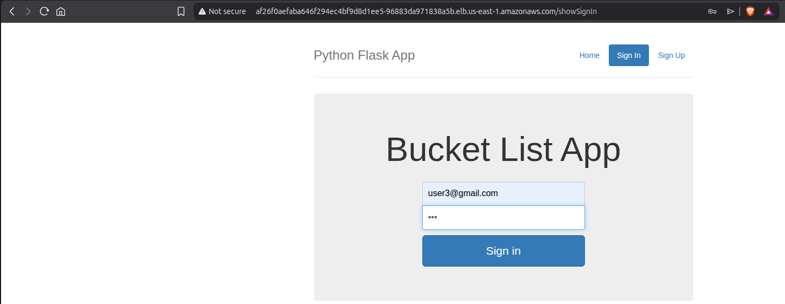</td>
  </tr>
  <tr>
    <td align="center"><i>User 3 authenticating on Azure AKS</i></td>
    <td align="center"><i>User 3 authenticating on AWS EKS (Restored state)</i></td>
  </tr>

  <!-- Row 2: Data/Wishlist Screens -->
  <tr>
    <td align="center">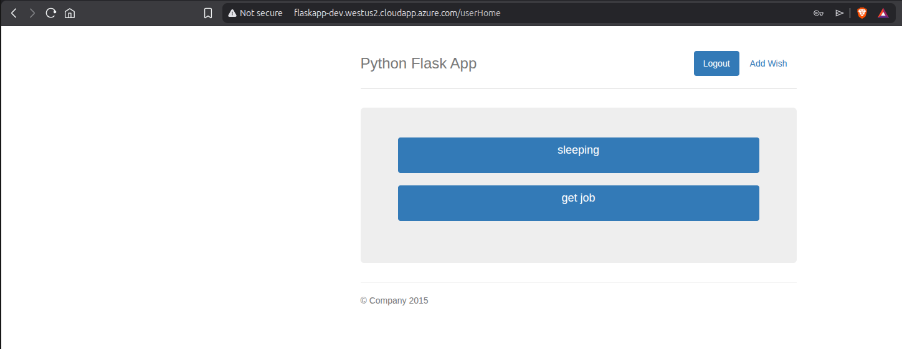</td>
    <td align="center">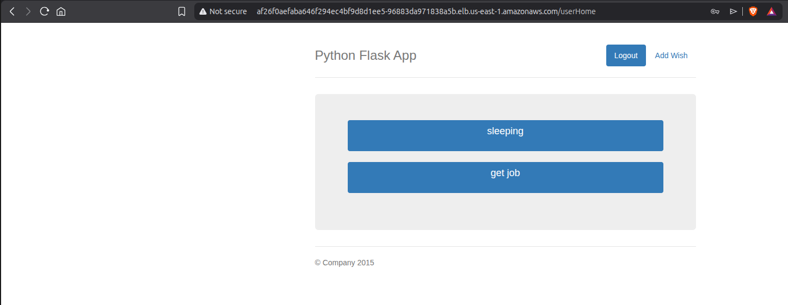</td>
  </tr>
  <tr>
    <td align="center"><b>Azure Data State</b> <i>User's original data prior to DR backup</i></td>
    <td align="center"><b>AWS Data State</b> <i>Exact same data successfully restored & accessible</i></td>
  </tr>
</table>

---

